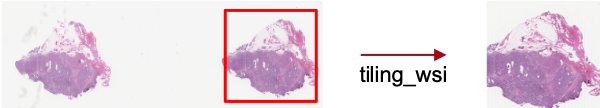
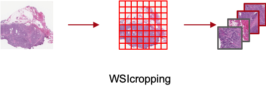
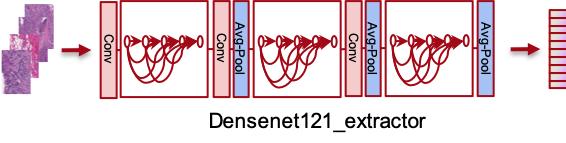

## Predict Chromosomal Instability Status (CIN) from Histopathology Images


[](https://www.python.org/downloads/release/python-2715/)
[](https://www.tensorflow.org/install/source)
[](https://opensource.org/licenses/MIT)


The CIN algorithm is a weakly supervised learning method based on **Densenet** [[1]](#1) architecture which is pre-trained using ImageNet images [[2]](#2).


The algorithm classifies genome CIN+/CIN- based on H&E histology whole slide images (WSI)

To run the CIN framework please follow these steps:

###   **Software** 

Install the following softwares used in this project:

*TensorFlow2*: Follow the instruction from here: https://www.tensorflow.org/install/

*OpenSlide*： Python version. See more details here: https://openslide.org/

*HistomicsTK*: Used for color normalization. Follow the instrction from here to install: https://digitalslidearchive.github.io/HistomicsTK/installation.html

###   **Genome CIN Score** 

See codes for genome CIN score calculation at '/Codes/Genome CIN/CIN_SCORE_CALCULATION.R'

###   **Image Preprocessing**

Follow the steps below to tile WSI from svs file and crop WSI into multiple patches of each patient. See codes under the folder '/Codes/Preprocessing'

#### Tile WSI



Use the function of **tiling_wsi** to get the best WSI from raw svs file. The default setting will get WSI on 2.5x magnification with dimension of 2048px2048p. Through setting *tilesize* and *overlap* can change the step size of sliding windows.

You need to define two *list* objects ahead:  *filepaths* and *samplenames*. Also set the argument of *tile_dir* for the location to store WSI.

`filepaths : list of svs file paths`

`samplenames : list of sample names with the same order of filepaths. For example: 'TCGA-A1-A0SE-01Z-00-DX1.04B09232-C6C4-46EF-AA2C-41D078D0A80A'`

`tile_dir : location to store WSI. For example: '/Image/WSI/'`


#### Crop WSI



Use the function of **WSIcropping** to crop input images into 8x8 nonoverlapping grids and save patches into target location. You can set up a tissue percentage threshold for QC. This function outputs patches and organize them in the structure of one folder per patient. Please refer to '/Image/Patch/'

`inputdir : input directory. example: /Image/WSI/`

`targetdir : target directory. example: /Image/Patch/`

`pct : tissue percentage threshold. Default is 80%`


###   **Feature Extraction**

This step used transfer learning to extract patch features and aggregate into patient level features.



See codes at '/Codes/Feature Extraction/FeatureExtraction.py'

First, set lab reference for color normalization. 

```bash
ref_img_path='/Image/WSI/IMAGE_NAME.jpg'
```

Then, use the function of **Densenet121_extractor** to extract patient level features from cropped patches generated by last step stored in '/Image/Patch'. You will need to organize a pandas DataFrame object or a .csv file (WSI_df) to store the image information including patch location and CIN score that will be used as labels after. A sample dataframe can be found in '/File/WSI_df.csv'. This function will automatically conduct color normalization. 

`WSI_df : a pandas dataframe. All patients' patches' in the dataframe will be extracted and aggregated. It should contain a column with name of 'Barcode_Path' to store the paths of patients' folder. All patch images are stored under this folder. example: /Image/Patch/TCGA-3C-AALJ`

`target : target path of patient level features to be stored. example: '/Bottleneck_Features/features_densenet121.npy'`


###   **MLP Training**

Make sure you have loaded *WSI_df* (summarise DataFrame) and *features* (bottleneck features array) before training top MLP.

```bash
#load summarise dataframe
WSI_df=pd.read_csv('/File/WSI_df.csv', sep=',',index_col=0).reset_index(drop=True)

#load bottleneck features array
features=np.load('/Bottleneck_Features/features_densenet121.npy')
```

Run codes at '/Codes/MLP/MLP.py' and use function of **MLP_train** to train top MLP layers and save your model. You have to set up the following arguments:

`WSI_df: a dataframe of summarise file, the same one used in previous steps. make sure you have columns indicating label and patient ID`

`features: patient level feature array. `

`Label, ID: column names in WSI_df. example: ID='Barcode',Label='Cin_Label'`

`testratio: percentage of test dataset, default is 0.15. You don't need to set validation dataset because the function will automatically split training and validation dataset as ratio of 0.85/0.15 after setting aside of hold-out test set.`

`seed: used to split training and test dataset. default is 1001`

`Model_Name: name to store the model, example: 'Model.h5'`

`Learning parameters: layer_num,nodes_num_1,nodes_num_2,dropout,lr
you can set up to 2 hidden layers. Too many hidden layers is not likely to have good performance by experiments. Use layer_num to set number of hidden layers.Use nodes_num_1 and nodes_num_2 to set nodes number of two hidden layers. Only set nodes_num_2 when layer_num=2. You can set up dropout and learning rate. default setting: dropout=0,lr=0.00001`


## References
<a id="1">[1]</a> 
Huang, G. et al. (2017). 
Densely Connected Convolutional Networks.
IEEE Conference on Computer Vision and Pattern Recognition (CVPR). 
DOI :10.1109/CVPR.2017.243.

<a id="2">[2]</a> 
Deng, J. et al. (2009).
ImageNet: A Large-Scale Hierarchical Image Database.
IEEE Conference on Computer Vision and Pattern Recognition (CVPR).
http://www.image-net.org/papers/imagenet_cvpr09.bib
